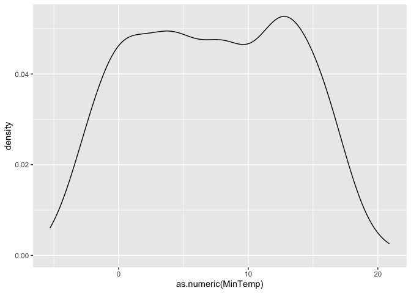

### References:

1.  Supervised Learning,
    <https://en.wikipedia.org/wiki/Supervised_learning>, accessed
    2015/10/07

### About Supervised Learning

This week we will be doing a supervised learning task. Supervised
learning models have a defined outcome and wish to use a set of
additional variables to predict that outcome. Ultimately what we want is
to have the algorithm guess the correct outcome based on data it has
never seen before.

Think about the ever-present example of customer churn we’ve been
talking through in our lectures. In that case, we have historic data for
which customers have renewed our service and which have cancelled. We
also have a set of properties about those customers. We can run a
supervised learning algorithm to guess whether current customers will
cancel or renew.

When doing supervised learning problems, there are a few terms that get
used quite a bit (as follows).

-   **Model Traning** – this is the process of creating the model. It
    generally means that we specify an outcome variable and a set of
    inputs and we run the model using some software package (R in our
    case).
-   **Training data** – this is the data used to train the model.
-   **Test data** – this is the data used to see if the training data
    will perform well on data it has never seen before. Generally
    speaking, the analyst will prepare one set of data and then split it
    into training data and test data.
-   **Confusion matrix** – this is the primary way we test to see if the
    algorithm has worked. Broadly speaking, we want to know how many
    times the algorithm guessed right and how many times it guessed
    wrong.
-   **Overfitting** – a model overfits the data when it has a very high
    accuracy on the training data and much worse accuracy on any other
    set of data. Overfitting is one of the most common issues seen in
    machine learning problems and is one of the most difficult things to
    avoid or fix. We won’t talk about it much here, this being an
    introductory course on analytics and not on machine learning.

Models are generally broken into two categories. There are machine
learning models and there are statistical models. Some types of models
show up in both categories. Broadly speaking, machine learning models
were created by computer scientists and focus a lot on prediction
accuracy and hardly at all on interpretability (the ability to describe
how the model functions). In contrast, statistical models were created
by statisticians. Prediction accuracy is also a focus here, but
statistical models tend to be more interpretable than machine learning
models (and generally less accurate in some scenarios).

### About the data

Data for this exercise contains weather observations from a number of
locations around Australia, obtained from the Australian Commonwealth
Bureau of Meteorology. The data has been processed to provide a target
variable RainTomorrow (whether there is rain on the following day -
No/Yes) and a risk variable RISK\_MM (how much rain). Various
transformations are performed on the data.

### The Process

All supervised learning projects follow the same rough process as
follows.

1.  Problem definition
2.  Data exploration
3.  Data cleaning
4.  Feature engineering
5.  Training
6.  Evaluation
7.  Production

In our case, item \#1 is done. We want to predict whether there will be
rain tomorrow based on the weather stats for today. We will now walk
through the rest of the steps here.

### Data Exploration and Data Cleaning

First, we need to load data set. In this case, we can download it easily
from the course’s database.

    d_weather <- tbl(mm,'weather') %>% collect() %>% mutate_at(vars(MinTemp:Sunshine,WindGustSpeed,WindSpeed9am,Pressure9am:Temp3pm,RISK_MM),as.numeric)

Next we look at summaries of each of the variables. Note that most
variables in the database are numeric but some are character data. For
example, WindGustDir (or Wind Gust Direction) is a character variable
telling us which direction the wind is blowing. Different models handle
character data in different ways. We’ll leave that discussion for
another course.

    summary(d_weather) # examine the summary statistics

    ##      Date             Location            MinTemp          MaxTemp         Rainfall       Evaporation        Sunshine      WindGustDir        WindGustSpeed    WindDir9am         WindDir3pm       
    ##  Length:366         Length:366         Min.   :-5.300   Min.   : 7.60   Min.   : 0.000   Min.   : 0.200   Min.   : 0.000   Length:366         Min.   :13.00   Length:366         Length:366        
    ##  Class :character   Class :character   1st Qu.: 2.300   1st Qu.:15.03   1st Qu.: 0.000   1st Qu.: 2.200   1st Qu.: 5.950   Class :character   1st Qu.:31.00   Class :character   Class :character  
    ##  Mode  :character   Mode  :character   Median : 7.450   Median :19.65   Median : 0.000   Median : 4.200   Median : 8.600   Mode  :character   Median :39.00   Mode  :character   Mode  :character  
    ##                                        Mean   : 7.266   Mean   :20.55   Mean   : 1.428   Mean   : 4.522   Mean   : 7.909                      Mean   :39.84                                        
    ##                                        3rd Qu.:12.500   3rd Qu.:25.50   3rd Qu.: 0.200   3rd Qu.: 6.400   3rd Qu.:10.500                      3rd Qu.:46.00                                        
    ##                                        Max.   :20.900   Max.   :35.80   Max.   :39.800   Max.   :13.800   Max.   :13.600                      Max.   :98.00                                        
    ##                                                                                                           NA's   :3                           NA's   :2                                            
    ##   WindSpeed9am     WindSpeed3pm    Humidity9am     Humidity3pm     Pressure9am      Pressure3pm        Cloud9am        Cloud3pm        Temp9am          Temp3pm       RainToday            RISK_MM      
    ##  Min.   : 0.000   Min.   : 0.00   Min.   :36.00   Min.   :13.00   Min.   : 996.5   Min.   : 996.8   Min.   :0.000   Min.   :0.000   Min.   : 0.100   Min.   : 5.10   Length:366         Min.   : 0.000  
    ##  1st Qu.: 6.000   1st Qu.:11.00   1st Qu.:64.00   1st Qu.:32.25   1st Qu.:1015.4   1st Qu.:1012.8   1st Qu.:1.000   1st Qu.:1.000   1st Qu.: 7.625   1st Qu.:14.15   Class :character   1st Qu.: 0.000  
    ##  Median : 7.000   Median :17.00   Median :72.00   Median :43.00   Median :1020.1   Median :1017.4   Median :3.500   Median :4.000   Median :12.550   Median :18.55   Mode  :character   Median : 0.000  
    ##  Mean   : 9.652   Mean   :17.99   Mean   :72.04   Mean   :44.52   Mean   :1019.7   Mean   :1016.8   Mean   :3.891   Mean   :4.025   Mean   :12.358   Mean   :19.23                      Mean   : 1.428  
    ##  3rd Qu.:13.000   3rd Qu.:24.00   3rd Qu.:81.00   3rd Qu.:55.00   3rd Qu.:1024.5   3rd Qu.:1021.5   3rd Qu.:7.000   3rd Qu.:7.000   3rd Qu.:17.000   3rd Qu.:24.00                      3rd Qu.: 0.200  
    ##  Max.   :41.000   Max.   :52.00   Max.   :99.00   Max.   :96.00   Max.   :1035.7   Max.   :1033.2   Max.   :8.000   Max.   :8.000   Max.   :24.700   Max.   :34.50                      Max.   :39.800  
    ##  NA's   :7                                                                                                                                                                                              
    ##  RainTomorrow      
    ##  Length:366        
    ##  Class :character  
    ##  Mode  :character  
    ##                    
    ##                    
    ##                    
    ## 

Remove attributes that aren’t going to be helpful based on initial
exploration (e.g. there is only a single location so remove this
attribute)

    d_weather_remove <- d_weather %>% select(-Location)
    names(d_weather_remove) # note that Location has been removed

    ##  [1] "Date"          "MinTemp"       "MaxTemp"       "Rainfall"      "Evaporation"   "Sunshine"      "WindGustDir"   "WindGustSpeed" "WindDir9am"    "WindDir3pm"    "WindSpeed9am"  "WindSpeed3pm" 
    ## [13] "Humidity9am"   "Humidity3pm"   "Pressure9am"   "Pressure3pm"   "Cloud9am"      "Cloud3pm"      "Temp9am"       "Temp3pm"       "RainToday"     "RISK_MM"       "RainTomorrow"

Convert data to the appropriate data type for each variable (e.g. Date
is a character so convert it to a date). Note that we now see summary
stats for the Date field.

    class(d_weather$Date)

    ## [1] "character"

    d_weather_date <- d_weather_remove %>% mutate(Date=as.Date(Date,format='%m/%d/%y'))
    summary(d_weather_date)

    ##       Date        MinTemp          MaxTemp         Rainfall       Evaporation        Sunshine      WindGustDir        WindGustSpeed    WindDir9am         WindDir3pm         WindSpeed9am     WindSpeed3pm  
    ##  Min.   :NA    Min.   :-5.300   Min.   : 7.60   Min.   : 0.000   Min.   : 0.200   Min.   : 0.000   Length:366         Min.   :13.00   Length:366         Length:366         Min.   : 0.000   Min.   : 0.00  
    ##  1st Qu.:NA    1st Qu.: 2.300   1st Qu.:15.03   1st Qu.: 0.000   1st Qu.: 2.200   1st Qu.: 5.950   Class :character   1st Qu.:31.00   Class :character   Class :character   1st Qu.: 6.000   1st Qu.:11.00  
    ##  Median :NA    Median : 7.450   Median :19.65   Median : 0.000   Median : 4.200   Median : 8.600   Mode  :character   Median :39.00   Mode  :character   Mode  :character   Median : 7.000   Median :17.00  
    ##  Mean   :NaN   Mean   : 7.266   Mean   :20.55   Mean   : 1.428   Mean   : 4.522   Mean   : 7.909                      Mean   :39.84                                         Mean   : 9.652   Mean   :17.99  
    ##  3rd Qu.:NA    3rd Qu.:12.500   3rd Qu.:25.50   3rd Qu.: 0.200   3rd Qu.: 6.400   3rd Qu.:10.500                      3rd Qu.:46.00                                         3rd Qu.:13.000   3rd Qu.:24.00  
    ##  Max.   :NA    Max.   :20.900   Max.   :35.80   Max.   :39.800   Max.   :13.800   Max.   :13.600                      Max.   :98.00                                         Max.   :41.000   Max.   :52.00  
    ##  NA's   :366                                                                      NA's   :3                           NA's   :2                                             NA's   :7                       
    ##   Humidity9am     Humidity3pm     Pressure9am      Pressure3pm        Cloud9am        Cloud3pm        Temp9am          Temp3pm       RainToday            RISK_MM       RainTomorrow      
    ##  Min.   :36.00   Min.   :13.00   Min.   : 996.5   Min.   : 996.8   Min.   :0.000   Min.   :0.000   Min.   : 0.100   Min.   : 5.10   Length:366         Min.   : 0.000   Length:366        
    ##  1st Qu.:64.00   1st Qu.:32.25   1st Qu.:1015.4   1st Qu.:1012.8   1st Qu.:1.000   1st Qu.:1.000   1st Qu.: 7.625   1st Qu.:14.15   Class :character   1st Qu.: 0.000   Class :character  
    ##  Median :72.00   Median :43.00   Median :1020.1   Median :1017.4   Median :3.500   Median :4.000   Median :12.550   Median :18.55   Mode  :character   Median : 0.000   Mode  :character  
    ##  Mean   :72.04   Mean   :44.52   Mean   :1019.7   Mean   :1016.8   Mean   :3.891   Mean   :4.025   Mean   :12.358   Mean   :19.23                      Mean   : 1.428                     
    ##  3rd Qu.:81.00   3rd Qu.:55.00   3rd Qu.:1024.5   3rd Qu.:1021.5   3rd Qu.:7.000   3rd Qu.:7.000   3rd Qu.:17.000   3rd Qu.:24.00                      3rd Qu.: 0.200                     
    ##  Max.   :99.00   Max.   :96.00   Max.   :1035.7   Max.   :1033.2   Max.   :8.000   Max.   :8.000   Max.   :24.700   Max.   :34.50                      Max.   :39.800                     
    ## 

Next we might want to create a few data visualizations to help us
understand the data better. Below we see a bar chart looking at the
different values of the Wind Gust Direction and a density plot of the
minimum temperature.

    ggplot(d_weather, aes(x=WindGustDir)) + geom_bar() + coord_flip()

    ggplot(d_weather, aes(x=as.numeric(MinTemp))) + geom_density()

### Feature Engineering

Feature engineering is a process where we decide which variables to
include as inputs and how we might need to transform those variables.
This could mean changing character data into numerical data in some way.
It could also mean combining variables in a way that makes sense for the
problem at hand. Feature engineering takes a good understanding of the
problem and some creativity.

Note that R handles character data naturally by creating what are called
dummy codes (also known, for some reason, as one-hot encoding). This is
where we create one variable for each of the values and then code them 1
for each value and 0 for all others.

### Model Training

The following code creates a decision tree model predicting the variable
“RainTomorrow” with a handful of the other data points as predictor
variables. These methods work by creating decision rules to decide what
the forecast should be. These models generally guess where the decision
rules should be placed and then check the accuracy of the model. In the
next step, the model will guess different decision rules and keep the
new rules if the model is more accurate. There are several variants of
decision tree models, they all use this basic set up but vary in the
details.

    decision_tree_model <- rpart(RainTomorrow ~ MinTemp + MaxTemp + Rainfall + Evaporation + Sunshine + WindGustDir + WindGustSpeed,data=d_weather_date)

Often the best way to test if the model is functioning is to create what
is called a Confusion Matrix. The following shows that we got 289 of the
actual “No” rain days rignt (in that we also predicted a No). Likewise
we got 41 “Yesses” right. This means that the model correctly classified
90%.

    d_weather_date$pred <- predict(decision_tree_model, type="class")
    confusion_matrix <- d_weather_date %>% count(RainTomorrow,pred) %>% pivot_wider(names_from=RainTomorrow,values_from=n)
    confusion_matrix %>% knitr::kable('html',col.names=c('Prediction','Actual: No','Actual: Yes'))

<table>
<thead>
<tr>
<th style="text-align:left;">
Prediction
</th>
<th style="text-align:right;">
Actual: No
</th>
<th style="text-align:right;">
Actual: Yes
</th>
</tr>
</thead>
<tbody>
<tr>
<td style="text-align:left;">
No
</td>
<td style="text-align:right;">
289
</td>
<td style="text-align:right;">
25
</td>
</tr>
<tr>
<td style="text-align:left;">
Yes
</td>
<td style="text-align:right;">
11
</td>
<td style="text-align:right;">
41
</td>
</tr>
</tbody>
</table>

### Visualize the decision tree

Depending on the type of decision tree model used, you can actually plot
the tree and inspect the details. The following is a plot of the tree we
have created.

    prp(decision_tree_model, extra = 2) 

# To-do

Log in to R Studio Cloud and click on Lab 6 in the workspace for this
course. This will be setup as an assignment which will create a
personalized version of the assignment. The environment is already setup
to complete the exercises. Open the file called “lab6\_turnin.Rmd” and
follow the instructions by editing that file.
